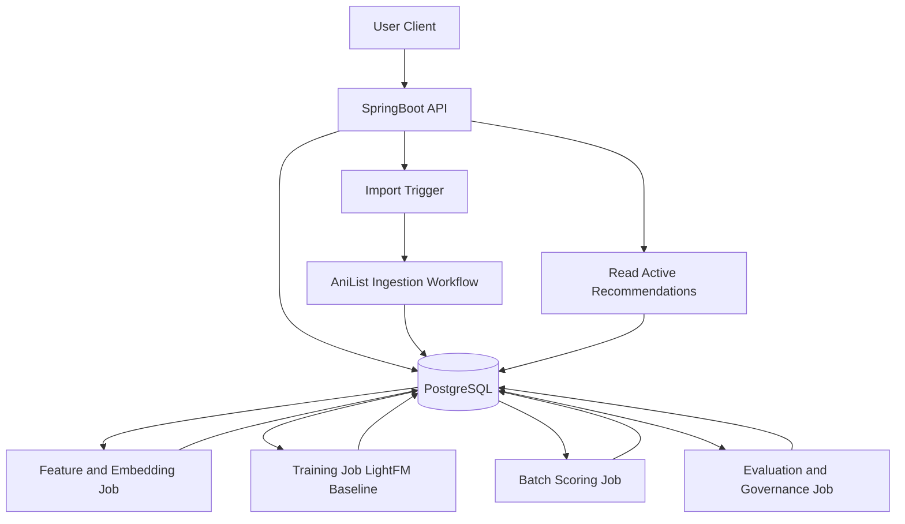

# System Architecture (MVP)

This document explains how the recommendation system is designed to work end-to-end in practical terms.

It is intentionally written for humans first: what runs where, who does what, how data moves, and how recommendations reach users.

---

## 1) Big Picture

The system is **one product with two runtimes**:

- **Spring Boot (Java)**: the public backend and API layer.
- **Python jobs**: internal batch pipelines for recommendation logic.

Users only talk to Spring Boot APIs. Python never sits on the request path.

### Core idea
Python computes recommendation outputs offline and writes them to Postgres.  
Spring Boot reads those stored outputs and serves them quickly.

---

## 2) Architecture Overview

---

## 3) Main Components and Responsibilities

## 3.1 Spring Boot API Service (Public)
Owns:
- Authentication and authorization.
- Import trigger/status endpoints.
- Recommendation retrieval endpoints.
- Feedback submission endpoints.
- Input validation and API error handling.

Does not own:
- Model training.
- Request-time ML inference.

## 3.2 Ingestion Workflow (AniList)
Owns:
- Fetching user history and catalog data from AniList.
- Normalizing statuses/titles/media types.
- Idempotent upserts into core tables.
- Run and error tracking.

## 3.3 Feature and Embedding Pipeline (Python)
Owns:
- Building item features from metadata.
- Creating text embeddings from title/synopsis/tags.
- Persisting feature lineage/version metadata.

## 3.4 Training Pipeline (Python)
Owns:
- Building weighted implicit feedback matrices.
- Training LightFM baseline (model-agnostic interface).
- Recording run metadata and metrics.

## 3.5 Batch Scoring Pipeline (Python)
Owns:
- Candidate generation and filtering.
- Ranking and top-N selection.
- Writing versioned recommendations (`model_version`, `generated_at`).
- Atomic activation/deactivation of recommendation generations.

## 3.6 Explanation Pipeline (Python, during/after scoring)
Owns:
- Creating human-readable reason payloads.
- Ensuring explanations are metadata-interpretable.

## 3.7 Evaluation and Governance (Python + operational policy)
Owns:
- Offline evaluation (Recall@K, NDCG@K).
- Baseline comparisons.
- Promotion and rollback decisions with audit trail.

---

## 4) Data Flow (End-to-End)

## Step A: User onboarding and import
1. User signs in and submits AniList username.
2. Spring Boot creates import run.
3. Ingestion workflow fetches AniList data.
4. Normalized users/items/interactions are stored in Postgres.

## Step B: Feature preparation
1. Feature job reads catalog + metadata.
2. Embedding job generates vectors from text.
3. Feature outputs are saved to Postgres.

## Step C: Model training
1. Training job reads interactions + features.
2. Applies weighting and recency logic.
3. Trains baseline model and logs run metadata.

## Step D: Batch recommendation generation
1. Scoring job loads model version and candidates.
2. Filters out excluded/consumed items.
3. Produces top-N results and explanation inputs.
4. Writes versioned rows and activates generation.

## Step E: API serving
1. User requests recommendations.
2. Spring Boot reads active generation from Postgres.
3. Returns ranked items with explanations.

## Step F: Feedback loop
1. User submits feedback.
2. Feedback stored in Postgres.
3. Next training run can incorporate this signal.

---

## 5) Why This Architecture

### Predictable API performance
Recommendations are precomputed, so API latency is stable.

### Clear boundary between app and ML
Spring handles product/backend concerns; Python handles recsys concerns.

### Safer operations
Failed training/scoring run does not break serving because prior active generation can remain live.

### Future model flexibility
LightFM is baseline, not permanent lock-in. Model contract is designed for swapability.

---

## 6) Key Storage Contracts (Postgres)

Important table groups:
- **Core domain**: users, items, item metadata, interactions, feedback.
- **ML artifacts/governance**: embeddings, model runs, optional artifact pointers.
- **Serving outputs**: recommendations (versioned + timestamped + active flag).

Critical contract rules:
- Store raw interaction events (do not destructively collapse).
- Version recommendation outputs by model.
- Keep run metadata for reproducibility and rollback.

---

## 7) Runtime and Deployment Mental Model

Think of this as:
- **Always-on app**: Spring Boot + Postgres.
- **Scheduled workers**: Python jobs running on cadence or manual trigger.

Typical cadence (MVP):
- Imports: on-demand + optional scheduled sync.
- Embedding refresh: daily incremental.
- Training: weekly (or manual).
- Scoring: daily.
- Evaluation: every training run.

---

## 8) Failure and Recovery Model

Design expectations:
- Jobs are idempotent where possible.
- Runs are tracked with status and diagnostics.
- Activation of new recommendations is atomic.
- Rollback can re-activate last known-good model version.

User impact during failures:
- If new scoring fails, users still get previous active recommendations.

---

## 9) What Is Not in Scope for MVP

- Request-time cross-language inference service.
- Vector database dependency.
- Graph DB-based reasoning.
- Real-time online model updates.
- Rich conversational recommendation UX.

These can be added later if the MVP proves value.

---

## 10) Implementation Ownership (Practical Split)

### Mostly Spring Boot
- API endpoints
- auth and request validation
- import orchestration triggers
- feedback APIs

### Mostly Python
- feature/embedding generation
- training, scoring, evaluation
- explanation generation logic

### Shared
- schema and migrations
- operational dashboards/alerts
- quality gates and release readiness

---

## 11) MVP Success Criteria (Architecture Perspective)

The architecture is considered successful when:
- Import -> train -> score -> serve loop works reliably.
- Recommendations are always served from active persisted outputs.
- Model versions can be promoted/rolled back safely.
- API remains stable while model internals evolve.

That is the core architectural promise of this system.
