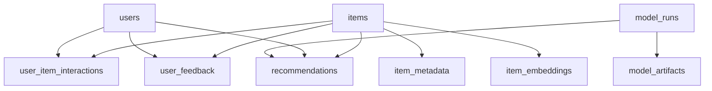

# Part 2: Domain Data Model and Schema

## 1) Purpose
Define the canonical PostgreSQL data model for Phase 1 so Spring Boot workflows, ingestion jobs, and Python training/scoring jobs share a stable storage contract.

This design prioritizes:
- idempotent ingestion,
- raw event retention for re-weighting,
- versioned recommendation outputs,
- reproducible experiment tracking.

---

## 2) Modeling Principles

1. **Canonical IDs**
   - Internal surrogate IDs for joins and service boundaries.
   - External source IDs retained for traceability and re-import.

2. **Raw-Then-Derived Data**
   - Preserve raw user interaction states.
   - Derive weighted training signals in pipeline, not in destructive persistence.

3. **Idempotent Writes**
   - Ingestion and scoring must be rerunnable without duplicates.
   - Unique constraints and deterministic keys enforce idempotency.

4. **Versioned Outputs**
   - Recommendations are model-versioned, timestamped, and replaceable by promoting different versions.

5. **Auditability**
   - Model runs capture config + data snapshot + metrics.
   - Schema supports reproducibility and rollback decisions.

---

## 3) Entity Inventory

Core domain entities:
- `users`
- `items`
- `item_metadata`
- `user_item_interactions`
- `user_feedback`
- `item_embeddings`
- `model_runs`
- `model_artifacts` (optional pointer registry)
- `recommendations`

Support entities:
- `ingestion_runs`
- `ingestion_errors`
- `job_runs` (generic operational run log; optional but recommended)

---

## 4) Relationship Overview

---

## 5) Table-by-Table Schema Specification

Type choices below are prescriptive defaults for PostgreSQL 15+.

## 5.1 `users`
Purpose: application user identity and lifecycle.

Columns:
- `id` `bigserial` primary key
- `uuid` `uuid` not null unique
- `email` `citext` unique null (if auth mode requires)
- `username` `varchar(64)` unique null (internal username)
- `anilist_username` `varchar(64)` null
- `created_at` `timestamptz` not null default now()
- `updated_at` `timestamptz` not null default now()
- `status` `varchar(20)` not null default 'active'

Constraints:
- check `status in ('active','disabled','pending')`

Indexes:
- unique index on `uuid`
- index on `anilist_username`

---

## 5.2 `items`
Purpose: canonical anime/manga catalog identity.

Columns:
- `id` `bigserial` primary key
- `external_source` `varchar(32)` not null default 'anilist'
- `external_id` `varchar(64)` not null
- `media_type` `varchar(16)` not null
- `canonical_title` `text` not null
- `title_english` `text` null
- `title_romaji` `text` null
- `title_native` `text` null
- `is_active` `boolean` not null default true
- `created_at` `timestamptz` not null default now()
- `updated_at` `timestamptz` not null default now()

Constraints:
- unique (`external_source`, `external_id`)
- check `media_type in ('anime','manga')`

Indexes:
- index on (`media_type`, `is_active`)
- index on `canonical_title` using trigram if fuzzy lookup needed later

---

## 5.3 `item_metadata`
Purpose: normalized metadata used by features and explanations.

Columns:
- `item_id` `bigint` primary key references `items(id)` on delete cascade
- `genres` `text[]` not null default '{}'
- `tags` `text[]` not null default '{}'
- `studios` `text[]` not null default '{}'
- `authors` `text[]` not null default '{}'
- `format` `varchar(32)` null
- `status` `varchar(32)` null
- `episodes_or_chapters` `integer` null
- `year_start` `integer` null
- `synopsis` `text` null
- `metadata_json` `jsonb` not null default '{}'::jsonb
- `metadata_version` `varchar(64)` not null default 'v1'
- `updated_at` `timestamptz` not null default now()

Indexes:
- gin index on `genres`
- gin index on `tags`
- gin index on `metadata_json`

---

## 5.4 `user_item_interactions`
Purpose: raw interaction facts retained for re-weighting and temporal modeling.

Columns:
- `id` `bigserial` primary key
- `user_id` `bigint` not null references `users(id)` on delete cascade
- `item_id` `bigint` not null references `items(id)` on delete cascade
- `status` `varchar(20)` not null
- `progress` `numeric(7,2)` null
- `rating` `numeric(4,2)` null
- `interaction_timestamp` `timestamptz` not null
- `source` `varchar(32)` not null
- `source_event_id` `varchar(128)` null
- `source_payload` `jsonb` not null default '{}'::jsonb
- `inserted_at` `timestamptz` not null default now()

Constraints:
- check `status in ('planned','in_progress','completed','dropped','paused')`
- check `source in ('anilist_import','explicit_feedback','system_backfill')`
- optional check `rating between 0 and 10`

Idempotency strategy:
- unique (`source`, `source_event_id`) when source provides stable event ids.
- fallback dedupe key unique (`user_id`,`item_id`,`status`,`interaction_timestamp`,`source`) where `source_event_id` is null.

Indexes:
- index (`user_id`, `interaction_timestamp` desc)
- index (`item_id`, `interaction_timestamp` desc)
- index (`status`)

---

## 5.5 `user_feedback`
Purpose: explicit post-recommendation feedback for future learning and UX telemetry.

Columns:
- `id` `bigserial` primary key
- `user_id` `bigint` not null references `users(id)` on delete cascade
- `item_id` `bigint` not null references `items(id)` on delete cascade
- `feedback_type` `varchar(32)` not null
- `reason_code` `varchar(64)` null
- `reason_text` `text` null
- `recommendation_model_version` `varchar(128)` null
- `recommendation_generated_at` `timestamptz` null
- `created_at` `timestamptz` not null default now()

Constraints:
- check `feedback_type in ('interested','not_interested','already_consumed')`

Indexes:
- index (`user_id`, `created_at` desc)
- index (`item_id`, `created_at` desc)

---

## 5.6 `item_embeddings`
Purpose: store embedding vectors and provenance.

Columns:
- `id` `bigserial` primary key
- `item_id` `bigint` not null references `items(id)` on delete cascade
- `embedding_model` `varchar(128)` not null
- `embedding_version` `varchar(64)` not null
- `embedding_dim` `integer` not null
- `embedding_vector` `jsonb` not null
- `text_signature` `varchar(128)` not null
- `generated_at` `timestamptz` not null
- `is_active` `boolean` not null default true

Constraints:
- unique (`item_id`, `embedding_model`, `embedding_version`, `text_signature`)

Indexes:
- index (`item_id`, `is_active`)
- index (`embedding_model`, `embedding_version`, `generated_at` desc)

Notes:
- JSONB vector storage is acceptable for Phase 1.
- If pgvector is introduced later, add sibling column and migration path without breaking contract.

---

## 5.7 `model_runs`
Purpose: experiment tracking and governance.

Columns:
- `id` `bigserial` primary key
- `run_id` `uuid` not null unique
- `model_family` `varchar(64)` not null
- `model_version` `varchar(128)` not null
- `run_type` `varchar(32)` not null
- `status` `varchar(32)` not null
- `config_json` `jsonb` not null
- `data_snapshot_hash` `varchar(128)` not null
- `metrics_json` `jsonb` null
- `started_at` `timestamptz` not null
- `completed_at` `timestamptz` null
- `failure_reason` `text` null
- `created_by` `varchar(64)` null
- `created_at` `timestamptz` not null default now()

Constraints:
- check `run_type in ('train','score','eval','train_and_score')`
- check `status in ('running','succeeded','failed','cancelled','promoted','superseded')`

Indexes:
- index (`model_family`, `model_version`)
- index (`status`, `created_at` desc)
- index (`data_snapshot_hash`)

---

## 5.8 `model_artifacts` (optional but recommended)
Purpose: pointer registry for serialized model artifacts.

Columns:
- `id` `bigserial` primary key
- `run_id` `uuid` not null references `model_runs(run_id)` on delete cascade
- `artifact_type` `varchar(64)` not null
- `artifact_uri` `text` not null
- `checksum` `varchar(128)` null
- `size_bytes` `bigint` null
- `created_at` `timestamptz` not null default now()

Constraints:
- unique (`run_id`, `artifact_type`)

Indexes:
- index (`run_id`)

---

## 5.9 `recommendations`
Purpose: versioned, query-ready recommendation outputs served by API.

Columns:
- `id` `bigserial` primary key
- `user_id` `bigint` not null references `users(id)` on delete cascade
- `item_id` `bigint` not null references `items(id)` on delete cascade
- `score` `double precision` not null
- `rank_position` `integer` not null
- `model_family` `varchar(64)` not null
- `model_version` `varchar(128)` not null
- `generated_at` `timestamptz` not null
- `explanation_inputs` `jsonb` not null default '{}'::jsonb
- `is_active` `boolean` not null default true

Constraints:
- unique (`user_id`, `item_id`, `model_version`, `generated_at`)
- check `rank_position > 0`

Indexes:
- index (`user_id`, `is_active`, `rank_position`)
- index (`model_version`, `generated_at` desc)
- index (`user_id`, `model_version`, `generated_at` desc)

Serving rule:
- API reads active recommendation set for current promoted model version.

---

## 5.10 `ingestion_runs`
Purpose: operational traceability for AniList imports.

Columns:
- `id` `bigserial` primary key
- `run_id` `uuid` not null unique
- `user_id` `bigint` null references `users(id)` on delete set null
- `source` `varchar(32)` not null default 'anilist'
- `status` `varchar(32)` not null
- `started_at` `timestamptz` not null
- `completed_at` `timestamptz` null
- `summary_json` `jsonb` not null default '{}'::jsonb
- `error_count` `integer` not null default 0

---

## 5.11 `ingestion_errors`
Purpose: store recoverable diagnostics from ingestion.

Columns:
- `id` `bigserial` primary key
- `ingestion_run_id` `bigint` not null references `ingestion_runs(id)` on delete cascade
- `error_code` `varchar(64)` not null
- `error_message` `text` not null
- `payload_json` `jsonb` not null default '{}'::jsonb
- `created_at` `timestamptz` not null default now()

Indexes:
- index (`ingestion_run_id`)

---

## 6) Query Patterns and Performance Expectations

### 6.1 Recommendation Serving
Pattern:
- Fetch top-N active recommendations by `user_id` and promoted `model_version`.
Expectation:
- P95 query latency acceptable for MVP API traffic under current user volume assumptions.

### 6.2 Training Extraction
Pattern:
- Scan recent/eligible interaction rows and join item features/embeddings.
Expectation:
- Job windows complete within scheduled batch budget.

### 6.3 Feedback Collection
Pattern:
- Insert user feedback events and retrieve recent feedback for diagnostics.
Expectation:
- write-heavy, append-centric; low contention.

---

## 7) Data Quality Invariants
- `users.uuid` unique and immutable.
- `items (external_source, external_id)` unique.
- Interaction status enum restricted to canonical set.
- `recommendations.rank_position` must be contiguous per user/model/generation at write time.
- `model_runs.data_snapshot_hash` required for reproducibility.
- `item_embeddings.embedding_dim` must match vector payload length validation in job layer.

---

## 8) Migration Sequencing (Flyway)

## Wave 1: Core Identity + Catalog + Interactions
Create:
- `users`
- `items`
- `item_metadata`
- `user_item_interactions`
- `ingestion_runs`
- `ingestion_errors`

Tasks:
- Add unique constraints for idempotent import.
- Backfill timestamps and normalization defaults.

Rollback/forward-fix guidance:
- Avoid destructive rollback for populated tables.
- Prefer forward-fix migration that patches constraints/defaults.

### Wave 2: Feedback + Recommendations
Create:
- `user_feedback`
- `recommendations`

Tasks:
- Add serving indexes for top-N reads.
- Add guards for rank uniqueness and model-version support.

Rollback/forward-fix guidance:
- Keep tables; deactivate bad rows with `is_active=false`.
- Repair malformed ranks via targeted data fix scripts.

### Wave 3: Embeddings + Model Governance
Create:
- `item_embeddings`
- `model_runs`
- `model_artifacts`

Tasks:
- Add run status constraints.
- Add run/version indexes for comparison and rollback support.

Rollback/forward-fix guidance:
- Never drop run history in rollback.
- Use status transitions (`failed`, `superseded`) instead of deletion.

---

## 9) Ownership Matrix

Write ownership:
- Spring Boot:
  - `users`, ingestion triggers/state, API-layer writes to `user_feedback`
- Ingestion workflow:
  - `items`, `item_metadata`, `user_item_interactions`, ingestion logs
- Python feature pipeline:
  - `item_embeddings`
- Python training/eval pipeline:
  - `model_runs`, `model_artifacts`, metrics fields
- Python scoring pipeline:
  - `recommendations`

Read ownership:
- Spring Boot API reads `recommendations`, `items`, explanation inputs, and relevant user records.
- Python jobs read canonical raw interaction + item + feature tables.

---

## 10) Open Decisions (Must Be Resolved Before Implementation Freeze)
1. Whether to enable pgvector in Phase 1 or keep JSONB-only vectors.
2. Final policy for `already_consumed` feedback transformation into interaction signals.
3. Whether rank uniqueness should be strictly constrained at DB level for each scoring run.

Proposed default for Phase 1:
- JSONB embeddings, strict feedback capture, and rank validation in scoring writer with post-write checks.

---

## 11) Exit Criteria
- Every planned API and job IO path maps to explicit table columns.
- Indexes exist for primary read/write workloads.
- Ingestion, scoring, and model governance are idempotent and auditable.
- Schema supports LightFM baseline now and model swaps later without API contract break.
