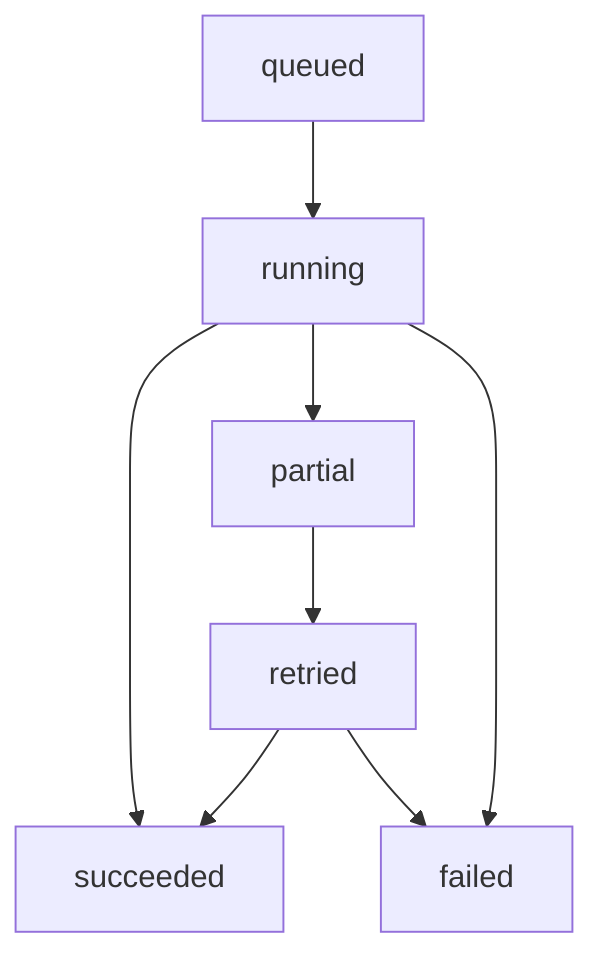

# Part 3: AniList Ingestion and Normalization

## 1) Purpose
Define an exact ingestion pipeline for AniList catalog and user-history data with deterministic normalization, idempotent upserts, and operationally safe retry behavior.

---

## 2) Integration Architecture

Components:
- Spring Boot import trigger/orchestration
- AniList API client
- Persistence writers to Part 2 schema
- Ingestion run logger (`ingestion_runs`, `ingestion_errors`)

Flow:
1. API trigger creates ingestion run.
2. Fetch user list and referenced media payloads.
3. Normalize payloads.
4. Upsert items + metadata.
5. Upsert interaction events.
6. Finalize run status with summary.

---

## 3) Import Lifecycle State Machine

State rules:
- `queued`: accepted but not started.
- `running`: active API fetch/normalize/persist.
- `partial`: non-critical failures occurred, partial ingestion persisted.
- `failed`: no reliable completion state, retry required.
- `succeeded`: all required steps completed.

---

## 4) Field Normalization Rules

## 4.1 Identity Normalization
- `external_source`: fixed to `anilist`.
- `external_id`: AniList media id as string.
- `media_type`: normalize to `anime|manga`.

## 4.2 Title Normalization
- `canonical_title` priority:
  1) English title if present,
  2) Romaji,
  3) Native,
  4) fallback synthetic placeholder with external id.

Store all available title variants.

## 4.3 Status Mapping
AniList to internal enum:
- `PLANNING` -> `planned`
- `CURRENT` -> `in_progress`
- `COMPLETED` -> `completed`
- `DROPPED` -> `dropped`
- `PAUSED` -> `paused`
- unknown/null -> default policy (skip or map to `planned`) with warning log

## 4.4 Progress and Rating
- Parse numeric progress safely; null if missing.
- Rating normalization:
  - convert AniList scoring type to normalized numeric scale used internally.
  - record original in `source_payload` for traceability.

## 4.5 Timestamp and Source
- `interaction_timestamp`: prefer AniList update timestamp, fallback run timestamp.
- `source`: `anilist_import`.
- `source_event_id`: deterministic event key when native id unavailable.

---

## 5) Upsert and Idempotency Strategy

## 5.1 Items
- Upsert by unique (`external_source`,`external_id`).
- Update mutable fields (`titles`, `is_active`, metadata snapshots).

## 5.2 Metadata
- Upsert by `item_id`.
- Refresh arrays and JSON metadata deterministically.

## 5.3 Interactions
- Preserve raw events.
- Deduplicate by:
  - preferred: (`source`,`source_event_id`)
  - fallback: (`user_id`,`item_id`,`status`,`interaction_timestamp`,`source`)

## 5.4 Re-import behavior
- Re-import updates current known state without duplicating prior equivalent events.
- Distinct state transitions over time remain stored for historical modeling.

---

## 6) Incremental Refresh and Backfill
- Full import allowed for first-time user.
- Incremental import for recurring sync based on AniList updated-at windows.
- Backfill mode for schema changes:
  - run with lower priority queue,
  - preserve run summaries and failure diagnostics.

---

## 7) Retry, Backoff, and Partial Failure Handling

Retry classes:
- transient AniList API/network issues -> exponential backoff with jitter
- parse/validation errors on individual records -> skip record, log error
- persistent auth/config failures -> fail run fast

Partial failure policy:
- catalog/interactions already persisted remain valid
- run status marked `partial`
- failed records tracked in `ingestion_errors`

---

## 8) Rate Limit and Throughput Controls
- Respect AniList rate limits with token-bucket or fixed delay strategy.
- Batch requests where possible to reduce call volume.
- Abort thresholds for repeated 429/5xx response bursts.

Operational targets:
- complete typical user import within acceptable SLA window.
- avoid provider abuse and minimize retry storms.

---

## 9) Data Quality Checks During Ingestion
- Reject rows missing required identity fields.
- Enforce valid normalized status enum before writing interaction.
- Validate media type consistency with payload shape.
- Emit metrics:
  - items upserted
  - interactions inserted/updated
  - skipped records
  - errors by code

---

## 10) Security and Safety
- Never log secrets/tokens.
- Bound incoming payload sizes and parsed field lengths.
- Sanitize and truncate untrusted text fields by policy before persistence.

---

## 11) Implementation Sequence
1. Build AniList client wrapper with retry/rate-limit behavior.
2. Implement normalization mappers and enum conversions.
3. Implement upsert repositories with idempotent keys.
4. Implement ingestion run state updates and error persistence.
5. Add import orchestration service.
6. Add integration tests for initial import, re-import, and partial failures.

---

## 12) Exit Criteria
- Re-imports are deterministic and non-destructive.
- Every AniList field used downstream has mapping rules.
- Idempotency constraints prevent event duplication.
- Run/error telemetry is sufficient for debugging and operations.
