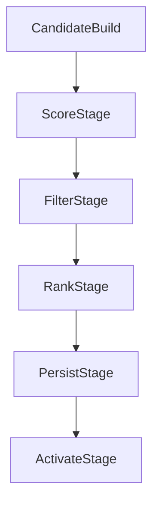

# Part 6: Batch Scoring, Candidate Generation, and Storage

## 1) Purpose
Define exact candidate generation, ranking, filtering, and persistence semantics that produce stable, versioned top-N recommendations for API serving.

---

## 2) Pipeline Stages

No stage may skip validation checkpoints.

---

## 3) Candidate Universe Definition

Candidate pool includes:
- active catalog items (`items.is_active=true`)
- items with required feature availability for model version
- item-level policy-compliant entities (not blocked/deprecated)

Optional candidate caps:
- global cap per user for compute control
- segment-aware caps (anime/manga balancing) if enabled

---

## 4) User and Item Eligibility Rules

User eligibility:
- authenticated active users
- users with minimum interaction history OR cold-start enabled path

Item eligibility:
- active items only
- optional minimum metadata completeness threshold
- exclude items missing mandatory fields for explanation contract

---

## 5) Exclusion Rules

Mandatory exclusions:
- already consumed/completed items
- explicit negative feedback blocks (`not_interested`)
- inactive catalog items

Configurable exclusions:
- dropped items (hard/soft suppress)
- paused items (penalty instead of exclusion)

All exclusion logic must be versioned with scoring config.

---

## 6) Ranking and Tie-Break Logic

Ranking rules:
1. primary sort by model score descending
2. deterministic tie-break:
   - secondary by item id ascending (or configured stable key)
3. assign contiguous `rank_position` starting at 1

Determinism requirement:
- identical inputs/config produce identical ordering.

---

## 7) Top-N and Coverage Checks

Top-N:
- configurable default (e.g., N=20)
- enforce max cap (e.g., <=100)

Coverage checks:
- per-user minimum recommendation count threshold
- run-level eligible user coverage threshold

If coverage fails:
- run marked failed or partial per policy
- no activation of incomplete generation.

---

## 8) Storage and Idempotency

Write target:
- `recommendations` table with:
  - `user_id`, `item_id`, `score`, `rank_position`,
  - `model_family`, `model_version`, `generated_at`,
  - `explanation_inputs`, `is_active`

Idempotent write strategy:
- write into generation-scoped rows (`model_version`, `generated_at`)
- enforce uniqueness constraint
- safe rerun behavior:
  - replace same generation rows atomically, or
  - soft-delete/rewrite with transactional guard

---

## 9) Activation/Deactivation Semantics

Activation steps:
1. Persist full generation in inactive state.
2. Validate row counts, rank continuity, and constraint compliance.
3. Atomically mark new generation active.
4. Deactivate previous generation for same scope.

Safety rule:
- partial generation must never become active.

---

## 10) Failure and Recovery

Failure classes:
- scoring runtime failure
- persistence/constraint failure
- activation transaction failure

Recovery:
- retry from failed stage where safe
- if uncertain state, rollback active flag to previous known-good generation
- record failure metadata in `model_runs`/ops logs

---

## 11) Performance Envelope

Runtime constraints:
- scoring job completion within configured SLA window
- bounded memory via batched user scoring
- optional parallelism with shard-level checkpoints

Observability:
- users scored
- rows written
- exclusion counts by reason
- coverage %
- stage duration histogram

---

## 12) Implementation Sequence
1. Implement candidate selector.
2. Implement scoring executor with batch processing.
3. Implement exclusion and ranking transformer.
4. Implement generation-scoped persistence writer.
5. Implement activation transaction.
6. Implement coverage/quality guards.
7. Add end-to-end and failure injection tests.

---

## 13) Exit Criteria
- Score outputs are complete, versioned, and API-ready.
- Activation is atomic and safe against partial writes.
- Reruns are idempotent and deterministic.
- Coverage checks and failure paths are testable and enforced.
