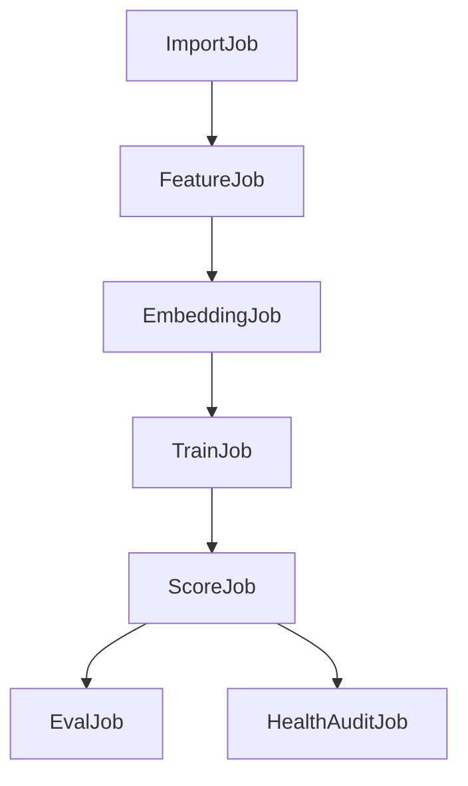

# Part 10: Jobs Orchestration, Observability, and Ops

## 1) Purpose
Define reliable operations for recurring ingestion, feature, training, scoring, and evaluation jobs with clear ownership, scheduling, and incident response.

---

## 2) Job Inventory

Core jobs:
- `anilist_import_job`
- `feature_build_job`
- `embedding_refresh_job`
- `train_model_job`
- `score_recommendations_job`
- `evaluate_model_job`

Support jobs:
- `backfill_embeddings_job`
- `recompute_explanations_job` (if decoupled)
- `health_audit_job`

---

## 3) Dependency Graph

Policy:
- avoid overlapping conflicting runs for same scope (global or per-user segment lock).

---

## 4) Scheduling Model

Default triggers:
- import: API-triggered + optional scheduled sync
- feature/embedding: daily incremental
- training: weekly scheduled + manual trigger
- scoring: daily scheduled (after successful model availability)
- evaluation: after training and on benchmark schedule

Scheduling controls:
- cron-based orchestration in Phase 1
- run window guards to prevent contention

---

## 5) Run-State Model

Common states:
- `queued`, `running`, `succeeded`, `failed`, `partial`, `cancelled`

Required run metadata:
- run id
- trigger source
- start/end timestamps
- upstream dependency versions
- summary counters
- failure diagnostics

---

## 6) Concurrency and Locking
- global lock for `train_model_job` and activation-sensitive scoring runs.
- per-user lock for import runs to avoid conflicting writes.
- lock timeout and deadlock recovery policy documented.

---

## 7) Observability: Logs, Metrics, Alerts

### Logging
- structured logs with `run_id`, `job_name`, `stage`, `status`.
- error logs include normalized error code and actionable context.

### Metrics
- job duration
- success/failure rates
- rows processed/written
- recommendation coverage
- data freshness age

### Alerts
- repeated job failure threshold exceeded
- stale recommendations age breach
- embedding coverage below train threshold
- activation failure events

---

## 8) Dashboards

Minimum dashboard panels:
- job success rate by type (7/30 day)
- median/p95 runtime per job
- latest model version + activation timestamp
- recommendation coverage trend
- ingestion error volume by code

---

## 9) Incident Response and Runbooks

Each critical job runbook must include:
- failure symptoms
- probable causes
- safe retry command/path
- rollback path
- verification checklist

Severity model:
- Sev1: no recommendation availability
- Sev2: stale recommendations beyond SLA
- Sev3: degraded import/feature freshness

---

## 10) Environment Strategy
- local: simplified schedules and mockable dependencies
- dev/staging: production-like cadence with reduced scale
- prod: strict schedule windows, alerts, and audit logging

Configuration model:
- environment-specific config files/env vars
- no hard-coded secrets

---

## 11) Backup, Recovery, and Retention
- retain `model_runs` and recommendation generations per policy.
- periodic DB backup with restore drill cadence.
- data retention policy for logs/errors and old inactive recommendation rows.

---

## 12) Operational SLOs (MVP)
- job success rate >= configured threshold
- recommendation freshness within documented SLA window
- alert acknowledgment and resolution targets by severity

---

## 13) Implementation Sequence
1. Define unified job metadata schema and logging fields.
2. Implement scheduler entries and dependency ordering.
3. Add locks and overlap protection.
4. Implement metrics emission.
5. Configure alerts and dashboards.
6. Write runbooks and incident SOPs.
7. Validate with failure-injection drills.

---

## 14) Exit Criteria
- Every critical job has trigger, owner, dependency map, and recovery path.
- Observability stack detects failures before SLA breach.
- Operational procedures are documented and drill-tested.
