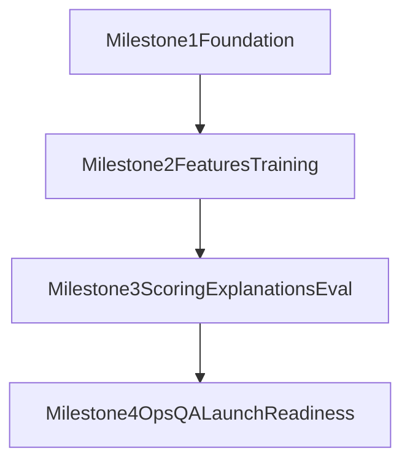

# Part 12: Delivery Roadmap and Incremental Milestones

## 1) Purpose
Translate Parts 1-11 into a dependency-aware execution roadmap with milestone-level scope, exit criteria, and go/no-go gates for MVP launch.

---

## 2) Roadmap Strategy
- Ship vertical slices with measurable outcomes.
- Prioritize critical-path dependencies early.
- Enforce quality/ops gates before launch decisions.
- Keep deferred scope explicit.

---

## 3) Milestone Overview

---

## 4) Milestone 1: Foundation (Schema + Ingestion + API Skeleton)

Scope:
- finalize core schema migrations (Part 2 waves needed for ingestion/API skeleton)
- implement import trigger/status API contracts (Part 8 subset)
- implement ingestion normalization and idempotent upserts (Part 3 core)

Must-have outputs:
- `users/items/item_metadata/user_item_interactions` operational
- deterministic import lifecycle and run logging
- API skeleton with validation/error envelope

Exit criteria:
- successful first import for test users
- re-import idempotency validated
- schema invariants and migration checks passing

Go/no-go gate:
- No open critical ingestion data-integrity defects.

---

## 5) Milestone 2: Features, Embeddings, Baseline Training

Scope:
- feature/embedding pipeline (Part 4)
- LightFM baseline train contract implementation (Part 5)
- model run metadata/artifact persistence

Must-have outputs:
- active embedding version generated for majority of catalog
- successful train run with metrics persisted
- reproducible run with snapshot hash/config capture

Exit criteria:
- embedding coverage threshold met
- training pipeline deterministic under fixed seed/config
- governance metadata complete

Go/no-go gate:
- Train run success rate and quality gates acceptable.

---

## 6) Milestone 3: Scoring, Explanations, and Evaluation Gates

Scope:
- batch scoring pipeline and activation semantics (Part 6)
- explanation generation pipeline (Part 7)
- evaluation and promotion policies (Part 9)
- recommendation API response completion (Part 8 full)

Must-have outputs:
- versioned recommendations stored and retrievable
- explanation payload for recommendations
- baseline vs candidate comparison flow

Exit criteria:
- active recommendation set generation stable
- explanation coverage and validity thresholds met
- promotion/rollback workflow tested

Go/no-go gate:
- candidate model meets evaluation thresholds or approved manual override path.

---

## 7) Milestone 4: Ops Hardening, QA Gates, and Launch Readiness

Scope:
- orchestration, alerting, runbooks (Part 10)
- full test strategy and CI gates (Part 11)
- final launch checklist and rollback readiness

Must-have outputs:
- scheduled jobs with monitoring and alerting
- pre-merge and nightly test gates operational
- incident response and rollback drill completed

Exit criteria:
- operational SLOs stable over burn-in period
- release quality gates from Part 1 all green
- no unresolved Sev1/Sev2 blockers

Go/no-go gate:
- launch readiness review sign-off by engineering owner(s).

---

## 8) Dependency and Critical Path

Critical path:
1. Part 2 schema readiness
2. Part 3 ingestion stability
3. Part 4 feature/embedding coverage
4. Part 5 train reliability
5. Part 6 scoring activation safety
6. Part 8 API readiness
7. Part 9 promotion governance
8. Part 10/11 operational + quality hardening

Parallelizable tracks:
- API skeleton and ingestion orchestration can start concurrently after schema base.
- explanation templates can start while scoring persistence is finalized.

---

## 9) Risk Register and Mitigation Triggers

Top risks:
- insufficient quality lift vs baseline
- embedding coverage gaps
- ingestion instability from external API constraints
- scoring job performance bottlenecks

Mitigation triggers:
- if quality lift below threshold for 2 consecutive runs -> run model/config review sprint
- if coverage under threshold -> block training and trigger embedding backfill
- if import failures exceed threshold -> activate degraded mode and retry policy review

---

## 10) Scope Control (Must / Should / Could)

Must:
- all Part 1 release gates
- versioned recommendations and rollback path
- deterministic API and pipeline contracts

Should:
- admin model-version override endpoint
- additional diagnostics dashboards

Could:
- diversification heuristics
- deeper novelty/diversity reporting

---

## 11) Definition of Done by Milestone
- scope items complete and test-verified
- documentation updated for contracts and runbooks
- observability in place for new moving parts
- acceptance criteria formally checked

---

## 12) Launch Go/No-Go Checklist
- ingestion stable and idempotent
- feature/embedding coverage within threshold
- model evaluation and promotion policy passing
- recommendation freshness SLA maintained
- API and feedback flows stable
- rollback tested and operational

---

## 13) Post-MVP Deferred Backlog
- managed recommender benchmark integration
- vector database evaluation
- real-time inference experiments
- richer UX/front-end personalization surfaces
- advanced model families beyond baseline

---

## 14) Exit Criteria
- roadmap is dependency-aware and executable.
- each milestone has objective go/no-go gates.
- deferred scope is explicit and does not leak into MVP baseline.
